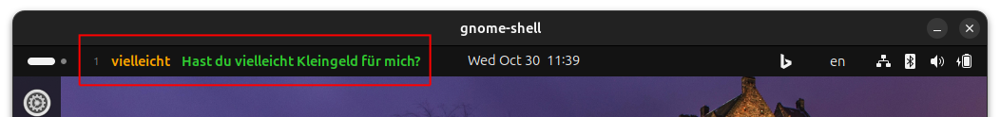

## GNOME Shell Extension for German Vocabulary Learning

This GNOME Shell extension displays German vocabulary words directly in the main panel of the GNOME desktop,
enabling users to learn and reinforce German language skills as part of their daily computer use.
The extension regularly updates with new words, complete with translations and example sentences.

